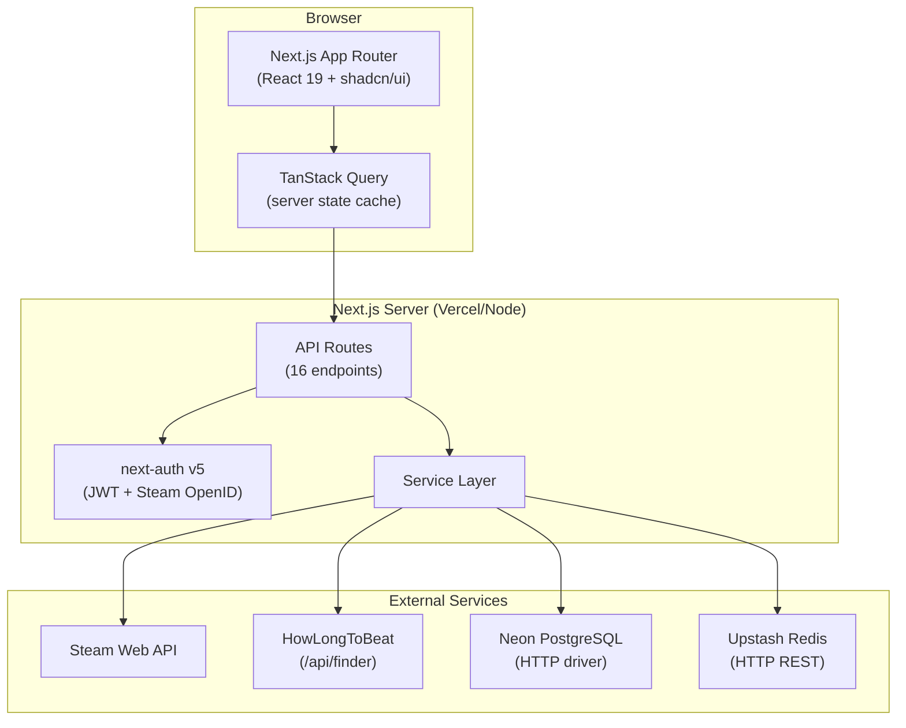
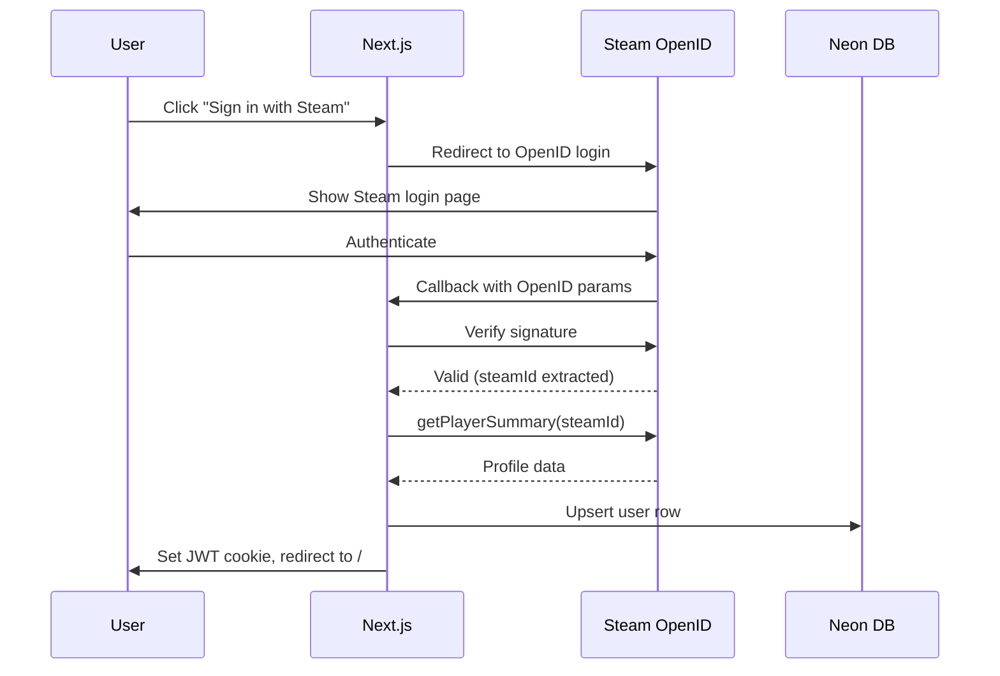
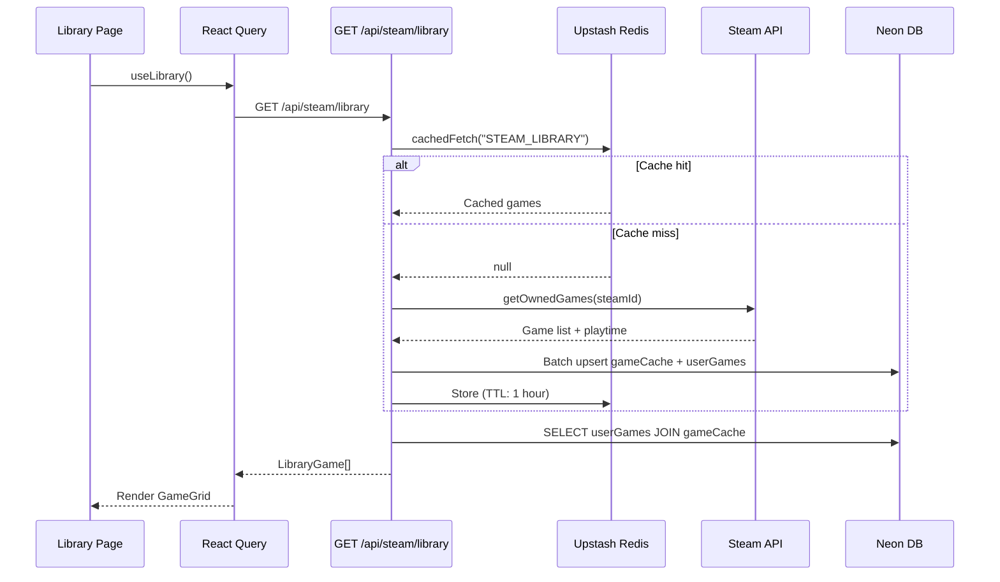
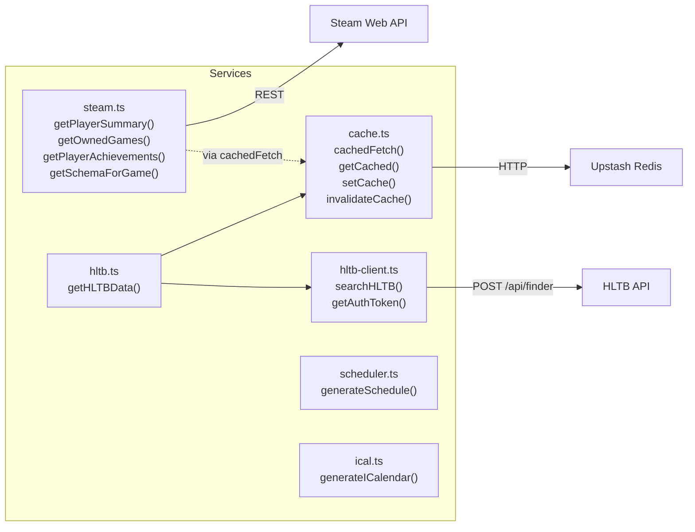
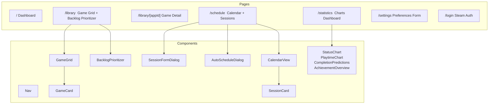

# Architecture

## System Overview



## Tech Stack

| Layer | Technology |
|-------|-----------|
| Framework | Next.js 16 (App Router) |
| UI | React 19, shadcn/ui, Tailwind CSS v4, Recharts, @dnd-kit |
| State | TanStack Query v5 (server), Zustand v5 (client) |
| Auth | next-auth v5 beta (JWT strategy, Steam OpenID) |
| Database | Neon PostgreSQL via Drizzle ORM (HTTP driver, no transactions) |
| Cache | Upstash Redis (HTTP REST) |
| Testing | Vitest 4, Playwright, PGlite |

## Database Schema

```mermaid
erDiagram
    users ||--o| userPreferences : "1:1"
    users ||--o{ userGames : "1:many"
    users ||--o{ userAchievements : "1:many"
    users ||--o{ scheduledSessions : "1:many"
    gameCache ||--o{ userGames : "1:many"
    gameCache ||--o{ userAchievements : "1:many"

    users {
        uuid id PK
        text steamId UK
        text steamUsername
        text avatarUrl
        text profileUrl
        timestamp createdAt
        timestamp updatedAt
    }

    userPreferences {
        uuid userId PK_FK
        int weeklyHours "default 10"
        int sessionLengthMinutes "default 60"
        text timezone "default UTC"
    }

    userGames {
        uuid userId PK_FK
        int steamAppId PK_FK
        enum status "backlog|playing|completed|abandoned"
        int priority "default 0"
        int playtimeMinutes
        timestamp lastPlayed
    }

    gameCache {
        int steamAppId PK
        text name
        text headerImageUrl
        int hltbMainMinutes
        int hltbExtraMinutes
        int hltbCompletionistMinutes
        int totalAchievements
        timestamp cachedAt
    }

    userAchievements {
        uuid userId PK_FK
        int steamAppId PK_FK
        int achievedCount
        int totalCount
        timestamp lastSynced
    }

    scheduledSessions {
        uuid id PK
        uuid userId FK
        int steamAppId
        timestamp startTime "UTC"
        timestamp endTime "UTC"
        boolean completed
        text notes "max 2000"
        timestamp createdAt
    }
```

## Authentication Flow



## Data Flow: Library Sync



## API Routes

### Auth
| Route | Method | Purpose |
|-------|--------|---------|
| `/api/auth/steam` | GET | Initiate Steam OpenID |
| `/api/auth/steam/callback` | GET | Handle callback, create user |

### Library
| Route | Method | Purpose |
|-------|--------|---------|
| `/api/steam/library` | GET | Sync + return user's games |
| `/api/games` | PATCH | Update game status/priority |
| `/api/games/batch` | PATCH | Batch priority update |

### Enrichment
| Route | Method | Purpose |
|-------|--------|---------|
| `/api/steam/achievements/{appId}` | GET | Per-game achievements |
| `/api/hltb/{appId}` | GET | HLTB completion times |

### Sessions
| Route | Method | Purpose |
|-------|--------|---------|
| `/api/sessions` | GET | List sessions (date range filter) |
| `/api/sessions` | POST | Create session |
| `/api/sessions/{id}` | PATCH | Update session |
| `/api/sessions/{id}` | DELETE | Delete session |
| `/api/sessions/auto-generate` | POST | Generate schedule from backlog |

### Export & Stats
| Route | Method | Purpose |
|-------|--------|---------|
| `/api/calendar/export.ics` | GET | iCal export |
| `/api/statistics` | GET | Achievement stats |
| `/api/preferences` | GET/PATCH | User preferences |

## Service Layer



## Caching Strategy

| Category | TTL | Key Format |
|----------|-----|-----------|
| STEAM_LIBRARY | 1 hour | `sbp:STEAM_LIBRARY:{steamId}` |
| STEAM_ACHIEVEMENTS | 30 min | `sbp:STEAM_ACHIEVEMENTS:{steamId}:{appId}` |
| HLTB_DATA | 7 days | `sbp:HLTB_DATA:{appId}` |
| GAME_METADATA | 24 hours | `sbp:GAME_METADATA:{appId}` |
| PLAYER_PROFILE | 6 hours | `sbp:PLAYER_PROFILE:{steamId}` |

**Null sentinel pattern:** Caches `{ __cacheNull: true }` to prevent repeated lookups for games without data.

**DB staleness check:** HLTB route re-fetches if `gameCache.cachedAt` is older than 30 days.

**Fail-open:** Redis errors are caught — requests proceed without cache rather than failing.

## Pages & Components



## Scheduling Algorithm

The auto-generate scheduler (`scheduler.ts`) uses a greedy forward-fill approach:

1. Calculate sessions per week: `(weeklyHours * 60) / sessionLengthMinutes`
2. For each backlog game (priority order):
   - Estimate sessions needed: `ceil((hltbMain - playtime) / sessionMinutes)` or default 3
   - Push to game queue
3. For each day in the date range:
   - Weekdays start at 19:00 local, weekends at 14:00 local
   - Pop next game from queue, create session
   - If game's sessions exhausted, move to next game
4. Convert all times from local timezone to UTC via `fromZonedTime()`

## Key Design Decisions

- **HTTP-only Postgres:** Neon's HTTP driver enables serverless deployment but doesn't support transactions. Multi-step writes use insert-before-delete pattern for safety.
- **Composite PKs:** `(userId, steamAppId)` for userGames/userAchievements ensures no duplicates.
- **Denormalized gameCache:** Avoids repeated Steam API calls; updated during library sync and HLTB fetch.
- **Custom HLTB client:** All npm packages (`howlongtobeat`, `howlongtobeat-core`, `howlongtobeat-js`) are broken. Custom client at `hltb-client.ts` talks directly to `/api/finder`.
- **UTC storage:** All timestamps stored in UTC. Client converts using user's timezone preference.
- **Batch upserts:** Library sync uses `onConflictDoUpdate` for efficient N-game sync in 2 queries.
- **Rate limiting:** Auto-generate endpoint limited to 3 req/60s per user via Redis INCR/EXPIRE.
